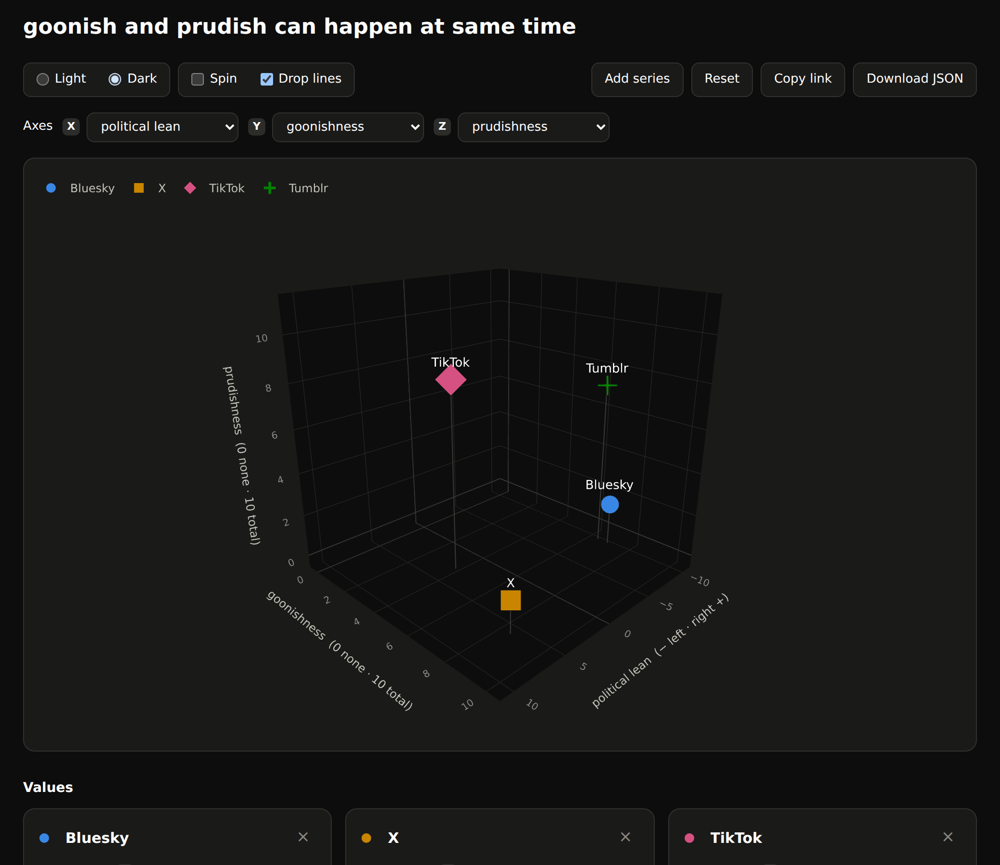

# 3dsocial

**→ [jsherman999.github.io/3dsocial](https://jsherman999.github.io/3dsocial/)**

A 2×2 political-compass meme forces a trade-off that isn't real. Putting
"prudish" at the top and "gooner" at the bottom of one axis says a platform
must be one or the other — but a platform can be both at once, and several
obviously are. That's not one axis with two ends. It's two axes.

So this is the same joke with the trade-off removed: independent dimensions,
drawn as a rotatable 3D scatter you can edit in the browser. Five ship —
**political lean**, **goonishness**, **prudishness**, **moral bankruptcy**,
and **intelligence** — and you pick which three are on X, Y and Z. Every
series keeps a value on all five whether or not it's currently plotted.



## Using it

Open the [live page](https://jsherman999.github.io/3dsocial/). Nothing to
install and nothing runs on a server — it's one static HTML file.

- **Drag to rotate**, scroll to zoom, shift-drag to pan. **Spin** orbits it for
  you, starting from wherever you left the camera.
- **Choose the axes** with the X / Y / Z pickers above the chart. Picking a
  dimension that's already on another axis swaps the two. The camera holds
  still through the change, and the sliders and table tag whichever three are
  live with their axis letter.
- **Edit any value** with the sliders under the chart — all five dimensions,
  not just the plotted ones. Rename a series, or use **Add series** / **×** to
  change who's on it (up to 8).
- **Copy link** puts your edits in the URL, so you can send someone the chart
  as you arranged it. Your edits also persist in your own browser until you hit
  **Reset**.
- **Light and dark** both ship. The page follows your OS setting on first load;
  the toggle overrides it and is remembered.
- **Drop lines** connect each point down to the floor plane. A projected 3D
  scatter is genuinely ambiguous about depth, and the stems are what let you
  read a point's position on the other two axes without rotating.

The starting values are opinionated guesses meant to be argued with, not
measurements. That's the point of making them editable.

## Editing the defaults

`data.json` has three parts: the `dimensions` that exist, which three `axes`
start on X/Y/Z, and the `entities` plotted.

```json
{
  "dimensions": {
    "prude": { "label": "prudishness", "axis_title": "prudishness  (0 none · 10 total)",
               "hint": "0 none ↔ 10 total", "min": 0, "max": 10 }
  },
  "axes": { "x": "lean", "y": "goon", "z": "prude" },
  "entities": [
    { "name": "Tumblr", "slot": 3, "lean": -8.0, "goon": 7.0, "prude": 7.5,
      "moral": 3.5, "intel": 7.0 }
  ]
}
```

`slot` is the color/shape slot and stays with the series for good, so deleting
one never repaints the others. `label` names the dimension in the UI,
`axis_title` is the rotated title on the cube, and `hint` supplies the two end
labels under each slider — split on the `↔`.

**Adding a sixth dimension is a `data.json` edit, not a code change.** Give it
a key under `dimensions` and it appears in the pickers, the sliders, and the
table; any entity missing a value for it starts at the midpoint of its range.
Ticks, range padding, and the drop-line floor are all derived from `min` and
`max`, so a dimension with a different scale needs no special handling.

Then rebuild the page:

```bash
pip install -r requirements.txt
python export.py                 # writes index.html
```

Pushing to `main` also rebuilds and redeploys it (`.github/workflows/pages.yml`).

### Turning Pages on

One manual step, once: **Settings → Pages → Source: GitHub Actions**. Enabling
Pages for the first time needs a repo-settings permission the workflow token
doesn't have, so the workflow can't do it for you — it skips the deploy and
says so until the switch is flipped.

("Deploy from a branch" → `main` → `/ (root)` works too, since `index.html` is
committed. You just lose the automatic rebuild from `data.json`.)

Other options:

```bash
python export.py --inline -o offline.html   # embeds plotly.js (~4.8 MB), no network needed
python export.py --data mine.json           # build from a different definition
python export.py --title "..." --subtitle "..."
```

`--inline` is the one to use for a file you want to email or open on a plane.
The default build pulls plotly.js from a CDN and is ~30 KB.

## Files

| | |
|---|---|
| `index.html` | the generated page — this is what Pages serves |
| `export.py` | builds `index.html`; owns the page shell and the browser code |
| `chart.py` | builds the plotly figure and the trace templates |
| `palette.py` | colors, shapes, and chrome tokens for both themes |
| `data.json` | dimensions, the starting axis mapping, and the values |
| `assets/` | optional per-series images ([see notes](assets/README.md)) |

All the styling lives in Python and is embedded into the page as JSON. The
browser code only fills numbers into pre-styled trace templates, so there is no
second copy of the design rules to drift out of sync.

## About the logos

The original meme used company logos. This doesn't, for two reasons.

The technical one: plotly.js draws 3D scene markers from a fixed set of shapes
and can't place an arbitrary image at a point in a rotating scene. Anything
logo-shaped out on the plot would have to be an HTML overlay reprojected on
every frame, which breaks the moment you rotate.

The other one: they're trademarks, and the terms come from each company's own
brand page. So the repo ships the *hook* rather than the files — add an `icon`
path to a series and it shows up as a badge in the editor and the table view.
See [`assets/README.md`](assets/README.md).

Out on the plot, each series is identified three ways instead: color, marker
shape, and its name printed next to the point.

## Design notes

- **The palette is validated, not eyeballed.** The four colors clear
  lightness-band, chroma, colorblind-separation, and contrast checks against
  each theme's own surface, in *all-pairs* mode — the right mode for a scatter,
  where any series can end up next to any other. Details and measurements are
  in `palette.py`.
- **Shape is a second identity channel.** The dark palette's closest pair sits
  in the marginal band for red-green colorblindness, and two light-mode hues
  fall below 3:1 against the surface. Distinct marker shapes plus the printed
  name are what make that safe, which is also why the point labels are always
  on.
- **There's a table view** under the chart with every exact value, so nothing
  is reachable only by hovering or only by color.
